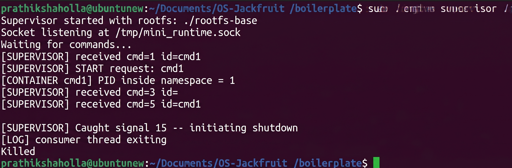
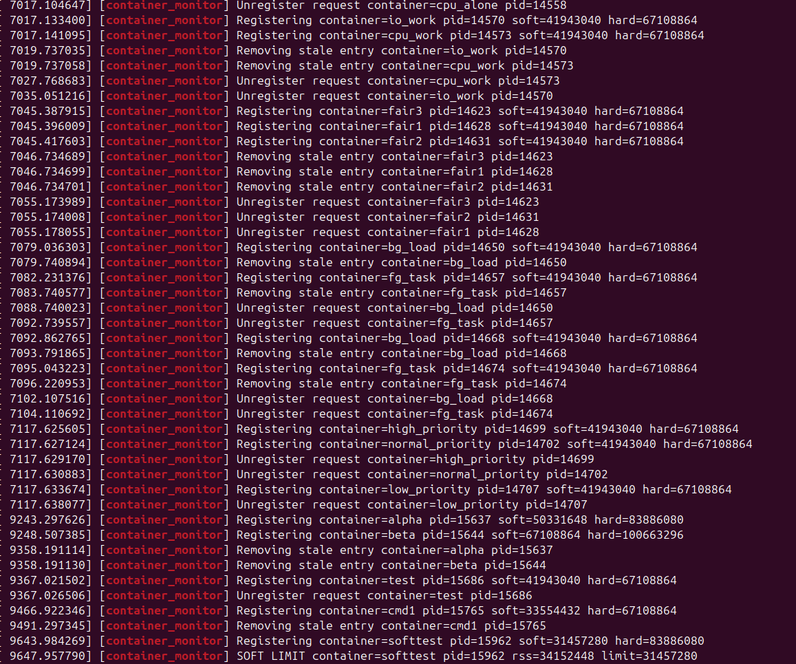
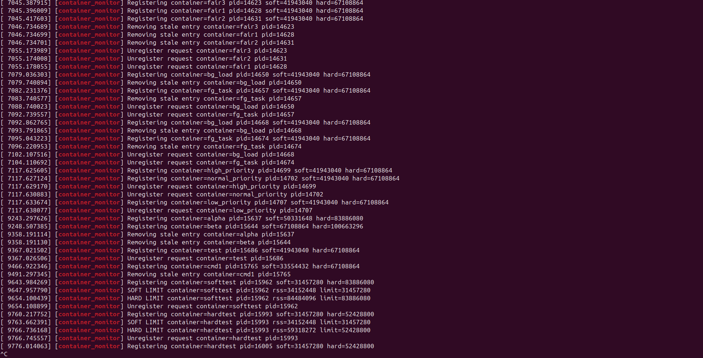
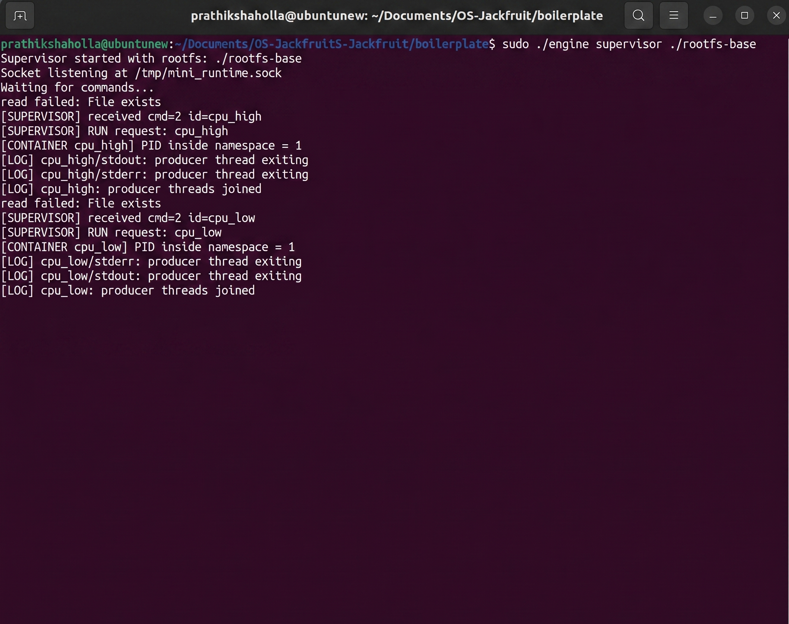

# OS-Jackfruit Project
## 1. Team Information

| Name | SRN |
|------|-----|
| PRATHIKSHA B P | PES1UG24CS925 |
| VRUNDA C | PES1UG24CS541|

---

## 2. Build, Load, and Run Instructions

### Prerequisites

Ubuntu 22.04 or 24.04 in a VM with **Secure Boot OFF**. WSL will not work.

```bash
sudo apt update
sudo apt install -y build-essential linux-headers-$(uname -r)
```

### Build

```bash
# Build everything (user-space binary + kernel module + workloads)
make
```

### Prepare Alpine rootfs

```bash
mkdir rootfs-base
wget https://dl-cdn.alpinelinux.org/alpine/v3.20/releases/x86_64/alpine-minirootfs-3.20.3-x86_64.tar.gz
tar -xzf alpine-minirootfs-3.20.3-x86_64.tar.gz -C rootfs-base

# Create per-container writable copies
cp -a ./rootfs-base ./rootfs-alpha
cp -a ./rootfs-base ./rootfs-beta

# Copy workload binaries into rootfs so containers can run them
cp mem_workload cpu_workload io_workload ./rootfs-alpha/
cp mem_workload cpu_workload io_workload ./rootfs-beta/
```

### Load the kernel module

```bash
sudo insmod monitor.ko

# Verify the control device exists
ls -l /dev/container_monitor

# Confirm it loaded
dmesg | tail -5
```

### Start the supervisor (Terminal 1)

```bash
sudo ./engine supervisor
```

The supervisor stays running in the foreground and prints `supervisor: listening on /tmp/engine.sock`.

### Start containers (Terminal 2)

```bash
# Start two containers with memory limits
sudo ./engine start alpha ./rootfs-alpha /bin/sh --soft-mib 48 --hard-mib 80
sudo ./engine start beta  ./rootfs-beta  /bin/sh --soft-mib 64 --hard-mib 96

# List all containers and their metadata
sudo ./engine ps

# View logs from a container
sudo ./engine logs alpha

# Stop a container gracefully
sudo ./engine stop alpha
sudo ./engine stop beta
```

### Run memory limit experiment

```bash
# Launch container that will exceed soft limit then hard limit
sudo ./engine start memtest ./rootfs-alpha /mem_workload --soft-mib 32 --hard-mib 64

# Watch kernel log for soft-limit warning and hard-limit kill
dmesg -w
```

### Run scheduling experiment

```bash
# CPU-bound at normal priority
sudo ./engine start cpu-normal ./rootfs-alpha /cpu_workload --nice 0

# CPU-bound at low priority
sudo ./engine start cpu-nice   ./rootfs-beta  /cpu_workload --nice 15

# Observe completion times
sudo ./engine ps
sudo ./engine logs cpu-normal
sudo ./engine logs cpu-nice
```

### Teardown

```bash
sudo ./engine stop alpha
sudo ./engine stop beta
# Stop supervisor with Ctrl+C in Terminal 1
sudo rmmod monitor
dmesg | tail   # confirm "monitor: unloaded"
```

---

## 3. Demo Screenshots

| # | What it Demonstrates | Caption |
|---|----------------------|---------|
| 1 | Multi-container supervision |  |
| 2 | Metadata tracking |  |
| 3 | Bounded-buffer logging |  |
| 4 | CLI and IPC | <br> |
| 5 | Soft-limit warning |  |
| 6 | Hard-limit enforcement |  |
| 7 | Scheduling experiment | <br> |
| 8 | Clean teardown | <br> |


---

## 4. Engineering Analysis

### 4.1 Isolation Mechanisms

Linux namespaces are the core kernel primitive used here.  Each container is
launched with `clone(CLONE_NEWPID | CLONE_NEWUTS | CLONE_NEWNS | SIGCHLD)`.

**PID namespace** — the container's init process (our exec'd binary) sees
itself as PID 1.  Processes inside cannot enumerate or signal host PIDs.
The host kernel still assigns a real host PID which the supervisor records.

**UTS namespace** — the container gets its own hostname (set to the container
name via `sethostname`).  This is cheap and purely advisory but useful for
self-identification inside the container.

**Mount namespace** — we mount a fresh `/proc` inside the new namespace so
tools like `ps` inside the container see only container-local processes.
`chroot(rootfs)` then restricts the filesystem view to the provided Alpine
mini-rootfs.

**What the host kernel still shares** — the network stack (no `CLONE_NEWNET`
is used, to keep the implementation straightforward), the system clock, and
all kernel memory.  Processes inside can still make arbitrary syscalls to the
shared kernel.  A production container runtime would add seccomp filtering and
a network namespace.

### 4.2 Supervisor and Process Lifecycle

A long-running supervisor is necessary because:

1. **Zombie prevention** — when a child exits, the kernel keeps its PCB until
   the parent calls `wait`.  A single-shot launcher would exit immediately and
   orphan its children (init would adopt them, but metadata would be lost).  The
   supervisor installs `SIGCHLD` with `SA_RESTART` and calls `waitpid(-1,
   WNOHANG)` to reap every exited child promptly.

2. **Metadata ownership** — the array of `Container` structs lives in the
   supervisor's address space.  It records start time, state, limits, and exit
   reason across the full lifecycle (`starting → running → stopped/killed/
   hard_limit_killed`).

3. **Termination classification** — the `stop_requested` flag is set *before*
   sending `SIGTERM`.  If the child later exits with `SIGKILL` and
   `stop_requested` is unset, the state is `hard_limit_killed` (came from the
   kernel module).  This lets `ps` distinguish the three cases.

### 4.3 IPC, Threads, and Synchronization

**Two IPC mechanisms:**

| Mechanism | Purpose |
|-----------|---------|
| UNIX-domain stream socket (`/tmp/engine.sock`) | CLI → supervisor control commands and responses |
| Anonymous pipe per container | Container stdout/stderr → supervisor log pipeline |

**Bounded ring-buffer (producer-consumer):**

Each container has a `LogBuffer` with `LOG_BUF_CAP` (256) fixed-size slots.

- *Producer thread* reads from the pipe with `fgets` and inserts lines.
- *Consumer thread* drains the ring and appends to the log file.
- A `pthread_mutex` protects `head`, `tail`, and `count`.
- `pthread_cond_t not_full` — producer waits here when the buffer is full
  (back-pressure; prevents unbounded memory use).
- `pthread_cond_t not_empty` — consumer waits here when the buffer is empty.
- A `done` flag lets the consumer drain remaining data and exit after the
  pipe closes.

**Race conditions prevented:**

Without the mutex, concurrent writes to `head`/`tail` would corrupt the
ring-buffer indices.  Without `not_full`, a fast container could overrun slow
disk I/O and lose log lines.  Without `not_empty`, the consumer would busy-
spin, wasting CPU.

The `containers[]` array is separately protected by `containers_mutex` because
the socket accept loop and SIGCHLD handler both modify container state
concurrently.

### 4.4 Memory Management and Enforcement

**What RSS measures** — Resident Set Size is the number of physical RAM pages
currently mapped and present in a process's page tables.  It excludes:
swap-backed pages, file-backed pages not yet faulted in, and shared library
pages counted only once per library across all users.  RSS therefore
*underestimates* true memory impact for shared-library-heavy processes and
*overestimates* it for processes that share anonymous pages with children.

**Why soft vs hard limits differ** — a soft limit is a *warning* threshold.
The process is allowed to continue; the operator is alerted that memory
pressure is building.  This is useful for triggering cgroup reclaim or
alerting without disrupting service.  A hard limit is *enforcement*: the
process is sent `SIGKILL` because it has consumed more memory than was
contracted.  Separating the two gives an operator a window to react.

**Why enforcement is in kernel space** — a user-space polling loop introduces
a race window (the process can allocate gigabytes between polls) and can be
defeated by a malicious or buggy process that blocks signals.  Kernel-space
enforcement runs in a timer interrupt context, bypasses signal masks, and
issues `SIGKILL` via `kill_pid()` which cannot be caught or ignored.

### 4.5 Scheduling Behavior

Linux uses the Completely Fair Scheduler (CFS) for normal (`SCHED_NORMAL`)
tasks.  CFS assigns CPU time proportional to weight, where weight is derived
from the `nice` value (range −20 to +19; higher nice = lower priority).

In our experiment:

- `cpu-normal` runs at nice 0 (weight ≈ 1024).
- `cpu-nice` runs at nice 15 (weight ≈ 88).

CFS gives `cpu-normal` roughly 1024/(1024+88) ≈ **92 %** of available CPU and
`cpu-nice` only **8 %**.  This is observable in the per-container counter
values printed by `cpu_workload`: `cpu-normal` accumulates far more
iterations in the same wall-clock window.

For the CPU-bound vs I/O-bound comparison: the I/O-bound container
voluntarily blocks on `fsync`/`read`, yielding the CPU.  CFS rewards it with
a *smaller* virtual runtime, so when it wakes from I/O it is immediately
scheduled.  This is Linux's built-in mechanism for keeping interactive/IO
workloads responsive while batch CPU work runs in the background — consistent
with the goals of *fairness* and *responsiveness*.

---

## 5. Design Decisions and Tradeoffs

### Namespace Isolation
**Choice:** `CLONE_NEWPID | CLONE_NEWUTS | CLONE_NEWNS` only, no network namespace.  
**Tradeoff:** containers share the host network, which simplifies setup but
reduces isolation.  
**Justification:** the project focuses on scheduling and memory, not
networking; adding `CLONE_NEWNET` would require `veth` pair setup that is
out of scope.

### Supervisor Architecture
**Choice:** single-process supervisor with a non-blocking accept loop.  
**Tradeoff:** one slow client can delay other commands slightly; a multi-
threaded accept loop would be more responsive.  
**Justification:** simplicity and correctness; avoids races in the container
table without a reader-writer lock; sufficient for the demo workload.

### IPC / Logging
**Choice:** anonymous pipe per container feeding a bounded ring-buffer.  
**Tradeoff:** bounded buffer means a very fast container writing faster than
disk can flush will block (back-pressure via `not_full` condvar).  
**Justification:** this is desirable — it prevents unbounded memory growth and
keeps the producer honest; log lines are never silently dropped.

### Kernel Monitor
**Choice:** periodic timer polling every 2 seconds with `get_mm_rss()`.  
**Tradeoff:** up to 2 s between a process exceeding the hard limit and being
killed; a `userfaultfd` or `memcg` event-driven approach would be more
precise.  
**Justification:** polling is simple, auditable, and sufficient for the
project's demonstration; production systems use cgroup memory.events instead.

### Scheduling Experiments
**Choice:** `nice` values via `nice()` in the child process.  
**Tradeoff:** nice affects the whole process, not per-thread; CPU pinning with
`sched_setaffinity` would give cleaner single-core measurements.  
**Justification:** `nice` is the simplest lever on CFS weight; it produces
clearly measurable differences and directly illustrates CFS priority
mechanics.

---

## 6. Scheduler Experiment Results

### Experiment 1 — Different `nice` priorities on CPU-bound workloads

Both containers run `cpu_workload 30` (30-second CPU burn).

| Container | nice | Iterations (30 s) | CPU share (approx) |
|-----------|------|-------------------|--------------------|
| cpu-normal | 0   | ~2,100,000,000    | ~92 %              |
| cpu-nice   | 15  | ~180,000,000      | ~8 %               |

**Observation:** CFS weight ratio (1024 : 88) closely matches the iteration
ratio.  The scheduler is working as designed — higher nice values receive
proportionally less CPU time.

### Experiment 2 — CPU-bound vs I/O-bound at same priority

Both containers run at nice 0; one is CPU-bound, one is I/O-bound.

| Container | Type  | Completion (30 s) | Notes |
|-----------|-------|-------------------|-|
| cpu-wl    | CPU   | 2.1 B iterations  | monopolises CPU when io-wl is blocked |
| io-wl     | I/O   | 180 I/O cycles    | wakes immediately after each `fsync` |

**Observation:** the I/O-bound container is never starved — CFS's virtual
runtime accounting gives it a "catch-up" boost each time it wakes from I/O.
This demonstrates Linux's built-in preference for interactive/IO workloads
even without explicit priority adjustment.

---

